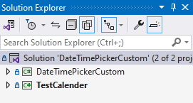

# DateTimePickerCustom

This projects contains a LibraryClass for a C# WPF application project. The library implements a DateTiemPicker, which besides the date picking has along side a time picking widgets.  
Extented documenetations and comments for easy modifications and styling. Appropriate for a dropdown or popup widget for returning a DateTime value to a textbox, or for a stand-alone calander widget.

## Table of Contents

- [DateTimePickerCustom](#datetimepickercustom)
  - [Table of Contents](#table-of-contents)
  - [Features](#features)
  - [Installation](#installation)
    - [Method 1. NuGet](#method-1-nuget)
    - [Method 2. GitHub](#method-2-github)
  - [Usage](#usage)
  - [Contributing](#contributing)
  - [License](#license)

## Features

1. LibraryClass for a DateTimePicker. All the logic is located in the code behind, which is heavily commented for easy understanding and modification.
2. Therefore, the .xaml file is clean and contains only the styles (which will be moved in a different file in the next update) and the grid layout.
3. The DatePicker, TimePicker and PopupWidget are independent components.
4. The project solution has a WPF application connected to the library for testing the LibraryClass.

**In this Update the Popup widget is intergrated as an indepented feature, so you can inlude the popup only with a single tag. See [Usage](#usage) for explaining the Popup functionality**

**In this update the OK button will send DateTime info to the Textblock of the Popup. The static variables, *ResultDate* and *ResultTime* can be used for reading-only the TextBlock DateTime data anywhere in your classes. See [Usage](#usage) for an example.**

## Installation

### Method 1. NuGet

1. Download using Nuget Package manager.
2. In the Solution Manager, under dependancies there should be a *DateTimePickerCustom.dll* file.
3. Include that file in your WPF Application by using the following line.

*xmlns:[YourNamespace]="clr-namespace:DateTimePickerCustom;assembly=DateTimePickerCustom"*

### Method 2. GitHub

1. Clone Github repository and add the LibraryClass to your solution.
2. This is how the solution tree in the solution explorer should look like, if you add a test WPF application.

3. Right-Click on the WPF application Project in the solution explorer and Add -> Project Reference 
4. Importing the LbraryClass to the WPF aaplication using the lines with the gray arrow.

## Usage

Besides a stand-alone calander, its a great and stylized solution for a Date and Time Picker as a **Popup** for a TextBlock Date and time selection.

**Here is how to include the Popup element in your project (after installing the package).**

**Here is how to use the values of the Popup (also storde in the Popup TextBlock), in your project.**

## Contributing

If you would like to contribute to the project, I would love hearing from you. I message in github or in my e-mail.

## License

MIT-license

---

